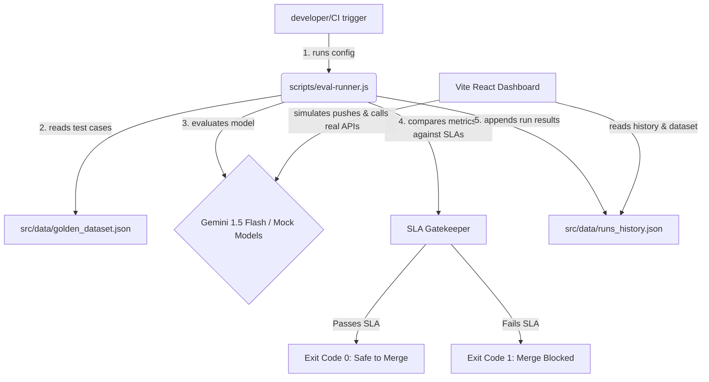

# LLM Eval CI/CD Workstation - Project Documentation

This document explains the architecture, folder structure, tool functionalities, and data flow connections for the **LLM Eval CI/CD Pipeline** project.

---

## 1. Project Architecture & Connection Flow

The project is structured as a self-contained continuous integration (CI) quality gate. It verifies LLM applications against a benchmark dataset before merging code.

---

## 2. What This Project Does & Why It Matters

Developing LLM-powered applications (like chatbots, RAG retrieval systems, or data extraction utilities) presents unique engineering challenges. Unlike traditional software, LLM outputs are non-deterministic, meaning the same prompt can yield different answers over time. Changing a single word in a system prompt or adjusting RAG parameters can trigger unforeseen hallucinations, decrease response relevance, or cause latency spikes.

This project solves the LLM reliability crisis by introducing an automated LLMOps Evaluation CI/CD Pipeline. It serves as an automated gatekeeper. When developers modify prompts or swap engines (such as using Google Gemini 1.5 Flash), the system automatically compiles and tests their configuration against a benchmark golden dataset of 100+ items. It measures faithfulness, hallucination rates, cost, and latency, blocking merges immediately if any Quality Gate SLA is breached.

### Core Value Proposition:
* **Continuous Quality Gates:** Just like unit tests block buggy code from getting merged, this project blocks prompt regressions. If a prompt update makes the LLM hallucinate more than 5% of the time, the Git merge is automatically blocked.
* **Systematic Benchmarking:** Maintains a golden dataset of 100+ standard question-answer pairs representing different categories. This ensures the model is tested across a representative distribution of real-world scenarios.
* **Interactive Optimization Workstation:** Allows developers to tweak prompt templates, test different engines (like Google Gemini 1.5 Flash), modify RAG parameters, and watch evaluations execute step-by-step with real-time logging.
* **Regression Audit Trail:** Compares different commits side-by-side. If a developer notices that a recent deployment has slowed down, they can quickly audit which prompt diff caused the latency regression.

---

## 3. Key Directories and Files

Here is where everything is located and what is used where:

* **[`/scripts/eval-runner.js`](file:///Users/anshityagi/solar/scripts/eval-runner.js)**
  * **Role:** Command Line Interface (CLI) Pipeline Runner.
  * **Used Where:** In the local terminal or git actions (`npm run eval`).
  * **Functionality:** Loads the benchmark cases, runs simulations, scores model responses, updates history, and enforces quality gates (exit 0/1).
  
* **[`/src/data/golden_dataset.json`](file:///Users/anshityagi/solar/src/data/golden_dataset.json)**
  * **Role:** Benchmark Golden Dataset.
  * **Used Where:** Read by the CLI runner and displayed in the frontend database explorer.
  * **Content:** 100+ standard question-answer pairs with reference contexts split into Customer Support, Technical Coding, Finance, and Legal categories.

* **[`/src/data/runs_history.json`](file:///Users/anshityagi/solar/src/data/runs_history.json)**
  * **Role:** Run History Database.
  * **Used Where:** Persists previous run data so that the frontend can display trend charts and enable comparisons between different commits.

* **[`/src/App.jsx`](file:///Users/anshityagi/solar/src/App.jsx)**
  * **Role:** Front-End Workstation Dashboard.
  * **Used Where:** React user interface.
  * **Functionality:** 
    * Displays trend graphs for Faithfulness, Hallucinations, and Latencies.
    * Features the **CI Run Simulator** where users can input prompts, change top-K values, select model engines, and call the Gemini API.
    * Features a **Slide-out TestCase Inspector** to view context grounding and generated outputs.

* **[`/src/index.css`](file:///Users/anshityagi/solar/src/index.css)**
  * **Role:** Theme & Styling.
  * **Used Where:** Global stylesheet.
  * **Functionality:** Configures HSL color variables, modern glassmorphism panels, high-contrast neon badges, radial gauge styling, and terminal log layouts.

---

## 4. Quality Gates & SLA Metrics scoring

The evaluation pipeline grades models based on five core criteria:

* **Hallucination Rate (SLA: <= 5%):** Calculates the proportion of assertions made by the LLM that cannot be justified by the reference context. 
  * **Real Gemini Path:** The system prompts the Gemini 1.5 Flash judge model to review the output against the reference context, assessing factual grounding and returning structured JSON scores.
  * **Simulated Path:** Applies hyperparameter-correlated randomized estimations (e.g., higher chunk sizes decrease hallucination estimations; missing constraints increase them) to simulate typical model outputs.
  If the hallucination rate exceeds 5%, the build is flagged as unstable.
* **Faithfulness (SLA: > 90%):** Calculates whether the generated response relies solely on the provided context document.
  * **Real Gemini Path:** The NLI judge verifies if the generated response pulls from external pre-trained knowledge instead of the grounding chunks.
  * **Simulated Path:** Applies randomized estimations based on prompt guidelines and top-K parameter ranges.
  If the model fails to rely strictly on retrieved chunks, the faithfulness score drops. High-quality systems require the model to rely strictly on retrieved chunks.
* **p95 Response Latency (SLA: <= 2000ms):** Ensures the 95th percentile response time is under 2 seconds. A prompt that is too long or retrieves too many docs (high top-K) slows down response times. Measuring p95 protects production from latency spikes.
* **Answer Relevancy (SLA: Informational):** Analyzes keyword overlap and semantic matching between the generated answer and expected ground truth. This ensures prompt adjustments did not alter the intended answer formatting or style.
* **Eval Cost (SLA: Informational):** Calculates the API cost based on input/output token counts and model token pricing structures, preventing sudden cost regressions.

---

## 5. User Guide: How to Use & Run

This workstation is designed for both local prompt development and automated pipeline testing.

### 1. Setting Up Google Gemini API Key
To perform real LLM audits, navigate to the "CI Run Simulator" tab, choose the "Gemini 1.5 Flash (REAL API - Free Tier)" model, and enter your free API Key from Google AI Studio. Note that the key starts with "AIzaSy" and is stored securely only in your browser's local storage.

### 2. Running Interactive Prompt Tests
Under the simulator tab, you can customize prompt templates (using `{{context}}` and `{{question}}` placeholders) and RAG chunk configurations. Adjust the "Evaluation Subset" to 10 cases to prevent API rate limits, and click "Commit Change & Run Pipeline". The retro terminal console will output a live log, showing test results step-by-step.

### 3. Auditing Regressions & Differences
Navigate to the "Dual-Run Comparator" tab and select two different commits. The dashboard will display a side-by-side comparison of the prompts and config settings alongside difference metrics, showing you exactly where the system degraded.

---

## 6. Transparency Log: Real vs. Simulated Components

To ensure complete clarity and transparency during interviews:

### 1. Model Responses
* **Simulated Models:** The local simulation scripts use pre-defined heuristics and standard statistical distributions to generate realistic responses and telemetry (latencies, token counts, cost) for testing the visualization dashboard.
* **Real Gemini Model:** Configured to make live HTTPS query requests to the Google Gemini 1.5 Flash API endpoint to fetch genuine responses generated in real-time.

### 2. Metric Grading Heuristics
* **Simulated Path:** Applies randomized variation calculations based on hyperparameters like chunk size and prompt constraints.
* **Real API Path (LLM-as-a-Judge):** Invokes a **two-step evaluation chain**. After the model generates an answer, the runner sends a second, separate API query to Gemini requesting it to act as a judge, grading the answer's **Faithfulness** and **Relevancy** against the context and formatting the output as JSON for parsed scoring.

### 3. Pipeline Failure Assertions
* **Simulated Path:** Always runs through 100% of test cases.
* **Real API Path:** Fast-fails loudly and terminates instantly on rate limits, network timeouts, or invalid authorization credentials, outputting standard status codes to warn the CI operator.

